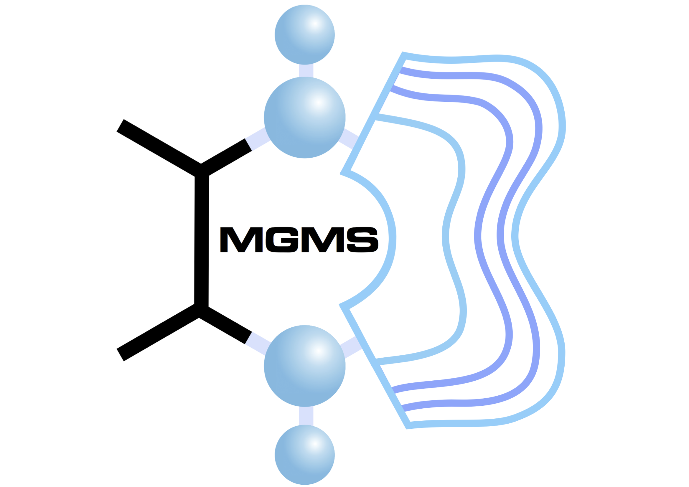

# Workshop for MDAnalysis/ML Edinburgh 2022

This repository contains all the materials for the 2022 MDAnalysis/ML workshop taking place at the University of Edinburgh on June 9-10 2022.

## Instructors
Irfan Alibay    
Matteo Degiacomi   
Richard Gowers   
Micaela Matta   
Antonia Mey   

## Location

University of Edinburgh, King’s Buildings Campus, [Murchison House, room G09](https://www.ed.ac.uk/timetabling-examinations/timetabling/room-bookings/bookable-rooms3/room/0654_00_G.09) - 10 Max Born Cres, Edinburgh EH9 3BF. 

See also [accessibility information](https://www.accessable.co.uk/the-university-of-edinburgh/king-s-buildings/access-guides/murchison-house#d2279e8b-6141-084a-857c-3d756f3983bb).

## Schedule

|  Day 1 	        | Session                 | Materials |
|---------------	|-------------------------|-----------|
| 9:00-9:30     	| Registration          	|   	|
| 9:30-9:40     	| Opening remarks       	|   	|
| 9:40-10:45    	| MDAnalysis            	|    	|
| 10:45-11:00   	| :coffee: break  :coffee:              	|   	|
| 11:00-12:30   	| MDAnalysis            	|    	|
| 12:30-13:30   	| Lunch                 	|   	|
| 13:30-14:45   	| ML Clustering          	|   	|  
| 14:45-15:00   	| :coffee: break   :coffee:             	|   	| 
| 15:00-16:20   	| ML Dimensionality Reduction          	|   	|
| 16:20-16:30   	| Closing remarks       	|   	|
| 18:00-onwards 	| Informal social event 	| [Steel Coulson, EH9 1PU](https://goo.gl/maps/ZNGPp9ZS1ag2ovFV9) 	|

|  Day 2 	        | Session                 | Materials |
|--- |--- |--- |
| 9:00-9:30	|  Slow start 	| |
| 9:30-9:40    	| Opening remarks  | |
| 9:40-10:45   	| ML Classification	| |
| 10:45-11:00  	| :coffee: break :coffee:	| |
| 11:00-12:30 	| ML Regression + Neural Networks	| |
| 12:30-13:30 	| Lunch | |
| 13:30-14:50 	|  Code Clinic 	| |
| 14:50-15:00  | Closing remarks |

## Setting up your python environment *before the workshop*

<!--The workshop will be hands-on. You will need a working installation of MDAnalysis and related packages including data to analyze in order to participate. The full installation may take up to about 1 GB of space (mostly for data, which you can delete after the workshop).--> 

Instructions for setting up your environment to run this workshop locally
are provided in [`INSTALL.md`](INSTALL.md).

A full list of the required Python packages can be seen inside [`environment.yml`](environment.yml).

As downloading and installing everything will take a little while, ideally you should follow these steps before the workshop starts. If you encounter any issues during installation, we can help!

## Google Colab

If for any reason you cannot set up a local environment with all required packages, you can use Google Colab to run all workshop notebooks directly from your browser, no installation required. 

## Course pre-requisites

The course assumes that attendees have a working knowledge of [Jupyter notebooks][1], Python (especially the [NumPy library][2]), and the bash shell.

## License

<!--TBA-->
The MDAnalysis logo and its derivatives are licensed under the Creative Commons Attribution-NoDerivs 3.0 Unported License.

## Sponsor 

We are grateful to the [Molecular Graphics and Modelling Society (MGMS)](https://www.mgms.org/WordPress/about/) for sponsoring the workshop.
The Society was formed in 1981 to bring together scientists working in different fields of study (such as chemistry, physics, biology, mathematics and computer science) who have a common interest in molecular modelling and graphics. The Society’s core activities involve the organising of conferences relevant to its community, as well as developing and encouraging scientists at the start of their careers.

## Acknowledgements

Please see [`AUTHORS.md`](AUTHORS.md) for a list of contributors to the workshop
materials.

##
[1]: https://jupyter-notebook.readthedocs.io/en/stable/
[2]: https://numpy.org/
